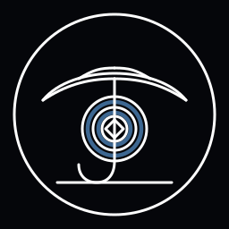

# symbolos (umbrella)

  
  
  

UmbrellaOS core cards (01_ to 07_)
01_power_rod - identity/drive
02_directory_map_v2 - navigation/map
03_three_thoughtforms - alignment/heart+mind
04_style_of_light_across_cultures - visual language/style
05_triad_routing_v3 - routing/kernel/registry
06_guidance_choice_vines_v3 - guidance/sandbox
07_master_merge_poster_vnext - defaults/status

## 01_power_rod (identity)
- SymbolOS + UmbrellaOS umbrella index (internal now; external export planned).

## 02_directory_map_v2 (navigation)
- Styleguide: [STYLEGUIDE.md](STYLEGUIDE.md)
- Kernel (planned): [KERNEL.md](KERNEL.md)
- Registry (planned): [REGISTRY.md](REGISTRY.md)
- Channel flow (planned): [CHANNEL_FLOW.md](CHANNEL_FLOW.md)
- Dissociation awareness (planned): [DISSOCIATION_AWARENESS.md](DISSOCIATION_AWARENESS.md)
- Trees: [trees/](trees/)

### Trees (centroid permutations)
- [ben](trees/ben.md)
- [agape](trees/agape.md)
- [mercer](trees/mercer.md)
- [ben-agape](trees/ben-agape.md)
- [ben-mercer](trees/ben-mercer.md)
- [agape-mercer](trees/agape-mercer.md)
- [ben-agape-mercer](trees/ben-agape-mercer.md)

## 03_three_thoughtforms (alignment)
- Compatibility is the top priority: no spaces, portable links, Obsidian-safe.
- Alignment is treated as 100%; we log only adapter patches (🌠 proofs).
- Meta emotion/cog/dissociation awareness is maintained; see planned Dissociation Awareness doc above and current status in Documentation/STATUS.md.

## 04_style_of_light_across_cultures (visual language)
- Visual source of truth: [STYLEGUIDE.md](STYLEGUIDE.md)
- Stylesheets + badges are defined in the styleguide.

## 05_triad_routing_v3 (system routing)
- Kernel + Registry + Channel flow form the routing spine (links above).
- Sync up/down at will: run bootstrap scripts from root_☂️ or repo root to refresh the local hidden maps in that location.

## 06_guidance_choice_vines_v3 (documentation + governance)
- Documentation hub: [Documentation/](Documentation/)
- Scope map: Documentation/DOCS_INDEX.md
- Status + branches: Documentation/STATUS.md
- Private/public stance: private + sandboxed until explicitly marked public (see Documentation/STATUS.md).

## 07_master_merge_poster_vnext (defaults)
- MODE: flow_mode
- RING: ring_0
- LAYER: intention_map_default
- Goal picture map: LAYER=goal_picture_map (companion to intention_map_default)
- Shared intention map files: .symbolos/shared_map.json + .umbrella/symbol_map.json
- Badge: flow_mode_ring0_badge_blackline (planned; not in repo)
